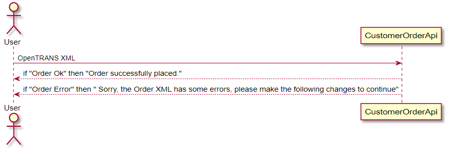
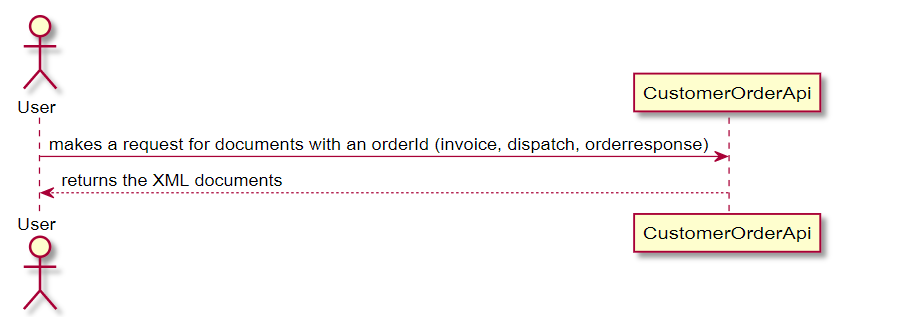
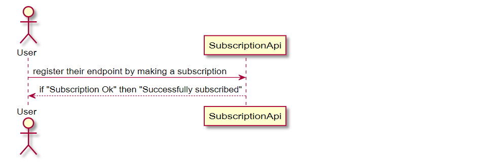

# JOE Order Documentation

---
The Main idea behind this API is to allow users to place orders by themselves with Jacob Elektronik, which potentially cuts short the long Customer EDI integration time.
---

## CustomerOrder API

Users have the opportunity to place the orders via this Customer order API. All the user needs to have is a [OpenTRANS](https://www.digital.iao.fraunhofer.de/de/publikationen/OpenTRANS21.html) XML file. This API takes the user's XML file and places the order at Jacob. If the order was successfully placed, the user receives a success response. If the order has any errors, the user gets notified about the problem, enabling him/her to make appropriate changes to the order.

## Order Information
Base-url : https://api.jacob.services/1.0/joe

| Url | Method | Short Description | Details Page |
| :--- | :--- | :--- | :--- |
| `Base-url?apikey=9876` | `GET` | Retrieves a list of all orders. | [Link](customerOrderApi/getOrders.md) |
| `Base-url?apikey=9876` | `POST` | Creates a new order. | [Link](customerOrderApi/createOrder.md) |

----------------------------------------------------------------------------------------------------------------------------------------

## Document Polling

The CustomerOrder API also serves its users with documents like, Orders, Invoices, DispatchNotes, OrderResponses. After successfully placing the order, the user can use the orderId to retrieve different documents related to the placed order. This also allows means for checking if a certain document is available yet.

## Documents Polling Information
Base-url : https://api.jacob.services/1.0/joe

| Url | Method | Short Description | Details Page |
| :--- | :--- | :--- | :--- |
| `Base-url/orderId/document?apikey=9876` | `GET` | Retrieves the different documents related to a particular order with the given orderId. | [Link](documentPolling/documentPolling.md) |

----------------------------------------------------------------------------------------------------------------------

## Subscription API

The Users also have a possibility of registering their endpoint's/url's, which gets notified whenever there is change in the state of the order.

Example events : 
- dispatch.generated
- invoice.generated
- response.generated

For this, the User has to make a subscription. Subscription API allows users to make subscriptions (or) register their endpoints and subscribe to specific events/state changes of the order, this registered endpoint is then notified letting the user know about the changes in their order.

Users have the possibility to subscribe to specific events or can subscribe to all the available events.

What is a subscription ? [Link](webhookSubscriptionApi/subscription.md)

# Subscription Information
Base-url : https://api.jacob.services/1.0/events/subscriptions

| Url | Method | Short Description | Details Page |
| :--- | :--- | :--- | :--- |
| `Base-url?apikey=abcdefghijklmnop` | `GET` | Retrieves a list of subscriptions of a user, with specific Event & Identifier. | [Link](webhookSubscriptionApi/getSubscriptions.md)|
| `Base-url?apikey=abcdefghijklmnop` | `POST` | Creates a subscription. | [Link](webhookSubscriptionApi/createSubscription.md)|
| `Base-url/{subscriptionId}?apikey=abcdefghijklmnop` | `GET` | Retrieves a specific subscription with a subscriptionId. | [Link](webhookSubscriptionApi/getSubscription.md)|
| `Base-url/{subscriptionId}?apikey=abcdefghijklmnop` | `PUT` | Replaces the whole subscription and updates it | [Link](webhookSubscriptionApi/putSubscription.md)|
| `Base-url/{subscriptionId}?apikey=abcdefghijklmnop` | `PATCH` | Checks for update and if necessary, updates the subscription | [Link](webhookSubscriptionApi/patchSubscription.md)|
| `Base-url/{subscriptionId}?apikey=abcdefghijklmnop` | `DELETE` | Deletes a subscription | [Link](webhookSubscriptionApi/deleteSubscription.md)|